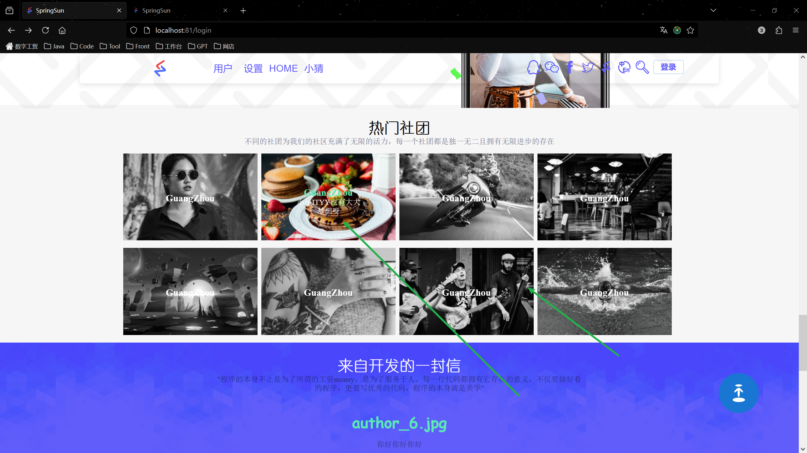
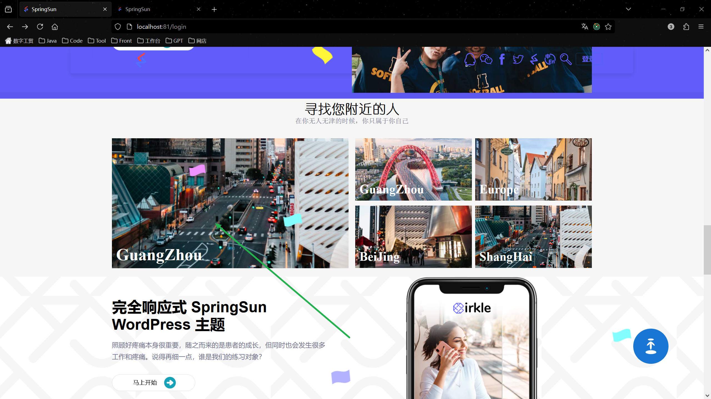

[TOC]

# 后端

如果B端C端都使用，文档内部就定义为C端功能，如果只是B端，那就是B端功能。

## B端


## C端

### config模块

用于C端的基本配置，配置信息、国际化、菜单

#### 国际化

使用redis实现国际化，方便自己修改，不用使用配置文件

1. 新增模块litchi-common-i18n

2. 主要代码

   ```java
   package com.lz.i18n.service;
   
   import com.lz.common.core.constant.redis.RedisI18nConstants;
   import com.lz.common.core.utils.StringUtils;
   import com.lz.common.core.utils.ip.IpUtils;
   import com.lz.common.redis.service.RedisService;
   import jakarta.annotation.Resource;
   import org.springframework.stereotype.Component;
   
   import java.util.concurrent.TimeUnit;
   
   import static com.lz.common.core.constant.redis.RedisConfigConstants.LOCALIZATION;
   import static com.lz.common.core.constant.redis.RedisI18nConstants.CONFIG_DEFAULT_LANGUAGE;
   
   /**
    * Project: Litchi
    * Package: com.lz.i18n
    * Author: YY
    * CreateTime: 2024-12-30  22:26
    * Description: I18nService
    * Version: 1.0
    */
   @Component
   public class I18nService {
       @Resource
       private RedisService redisService;
   
       /**
        * description: 设置用户的国际化语言
        * author: YY
        * method: setUserI18n
        * date: 2024/12/30 22:31
        * param:
        * param: key
        * param: value
        * return: void
        **/
       public void setUserI18n(final String value, Long timeout) {
           //使用ip地址作为国际化
           String ipAddr = IpUtils.getIpAddr();
           redisService.setCacheObject(RedisI18nConstants.I18N + ipAddr, value, timeout, TimeUnit.SECONDS);
       }
   
       /**
        * description: 获取用户国际化语言 如果没有返回默认的
        * author: YY
        * method: getUserI18n
        * date: 2024/12/30 22:33
        * param:
        * param: key
        * return: java.lang.String
        **/
       public String getUserI18n() {
           //使用ip地址作为国际化
           String ipAddr = IpUtils.getIpAddr();
           //获取用户国际化语言
           String value = redisService.getCacheObject(RedisI18nConstants.I18N + ipAddr);
           //如果没有获取默认
           if (StringUtils.isEmpty(value)) {
               value = redisService.getCacheObject(CONFIG_DEFAULT_LANGUAGE);
           }
           return value;
       }
   
       /**
        * description: 获取message
        * author: YY
        * method: getMessage
        * date: 2024/12/31 15:35
        * param:
        * param: key
        * return: java.lang.String
        **/
       public String getMessage(final String key) {
           //获取国家语言
           String userI18n = getUserI18n();
           String value = redisService.getCacheMapValue(LOCALIZATION + userI18n, key);
           if (StringUtils.isEmpty(value)) {
               return key;
           }
           return value;
       }
   }
   ```

3. 自动注入bean

   ```
   com.lz.i18n.service.I18nService
   ```


#### 配置和国际化message启动自动缓存

主要是这个注解：**@PostConstruct**

`@PostConstruct` 是 Jakarta EE（之前为 Java EE）中用于依赖注入的生命周期管理的一部分。它是一个注解，用来标识某个方法，在依赖注入完成之后执行，用于执行初始化工作。该方法必须在对象被使用之前调用。通常，它用于进行一些资源的初始化操作，比如初始化集合、设置默认值或是其他初始化的任务。

##### 主要功能：

1. **初始化**：标注了 `@PostConstruct` 注解的方法会在依赖注入（DI）完成后自动执行。这样可以确保类的实例已经完全初始化（依赖注入完成），此时可以进行额外的初始化工作。
2. **方法约束**：
   - 该方法必须是 `void` 返回类型。
   - 该方法不能有任何参数，除非它是拦截器方法（在 Jakarta Interceptors 中），拦截器方法可以接受 `InvocationContext` 作为参数。
   - 该方法可以是 `public`、`protected`、包私有或 `private`。
   - 该方法不能是 `static`，除非是应用客户端类。
   - 该方法不能是 `final`。
   - 如果方法抛出未经检查的异常（`UncheckedException`），则该类不会被投入使用，除非该异常被拦截器处理。
3. **与 `@PreDestroy` 配合使用**：`@PostConstruct` 通常与 `@PreDestroy` 注解配合使用，后者表示在销毁时调用的方法。两者用于管理对象的生命周期，在类的生命周期的不同阶段进行处理。
4. **只能标注一个方法**：在同一个类中，只能有一个方法使用 `@PostConstruct` 注解。

##### 用法示例：

```Java
import jakarta.annotation.PostConstruct;

public class MyService {

    private String someResource;

    @PostConstruct
    public void init() {
        // 依赖注入完成后初始化资源
        someResource = "Initialized Resource";
        System.out.println("Initialization done: " + someResource);
    }
}
```

##### 注意事项：

- `@PostConstruct` 标记的方法必须在依赖注入完成后执行，因此它通常用于资源的初始化或者一些初始化工作。该方法会在容器启动并完成依赖注入之后自动调用。
- 如果方法抛出了未经检查的异常，容器将会放弃创建该对象，除非该异常被拦截器捕获并处理。

##### 总结：

`@PostConstruct` 是一个依赖注入生命周期的标志性注解，用于在依赖注入完成后进行对象的初始化，它确保了对象在使用前完成必要的初始化工作。

##### 项目使用事例

**配置**

```java
/**
 * 项目启动时，初始化参数到缓存
 */
@PostConstruct
public void init() {
    loadingConfigCache();
}

private void loadingConfigCache() {
    ConfigInfo configInfo = new ConfigInfo();
    List<ConfigInfo> configInfos = configInfoMapper.selectConfigInfoList(configInfo);
    for (ConfigInfo info : configInfos) {
        redisService.setCacheObject(CONFIG + info.getConfigKey(), info.getConfigValue());
    }
}
```

**message**

```java
   /**
     * 项目启动时，初始化message 到缓存
     */
    @PostConstruct
    public void init() {
        loadingLocaleInfo();
    }

    @Override
    public void loadingLocaleInfo() {
        I18nLocaleInfo i18nLocaleInfo = new I18nLocaleInfo();
        i18nLocaleInfo.setLocaleStatus(CLocaleStatusEnum.LOCALE_STATUS_0.getValue());
        List<I18nLocaleInfo> i18nLocaleInfos = i18nLocaleInfoMapper.selectI18nLocaleInfoList(i18nLocaleInfo);
        for (I18nLocaleInfo info : i18nLocaleInfos) {
            setMessageCache(info);
        }
    }
```

`@PostConstruct` 和 `static` 块（即静态初始化块）在 Java 中都是用于初始化的机制，但它们有以下几个关键区别：

##### 与static的不同

###### 1. **作用范围不同**：

- `@PostConstruct`
  - 主要用于实例化对象时进行初始化操作，在依赖注入完成后被调用。它是实例级别的初始化方法，即在对象创建并完成依赖注入之后执行，确保该对象的依赖已完全注入。
  - 适用于使用依赖注入（例如在 Spring、Jakarta EE 等框架中）的类。
- `static` 块
  - 静态块是类级别的初始化代码，在类加载到 JVM 时自动执行一次。它在类的任何实例化之前运行，仅在类加载时调用一次。
  - 静态块通常用于初始化类级别的静态资源或者进行类级别的配置。

###### 2. **执行时机不同**：

- `@PostConstruct`
  - `@PostConstruct` 注解的方法是在对象的依赖注入完成之后执行的。它通常是在实例化对象之后，容器注入所有依赖项（例如字段、属性等）完成后自动调用。因此，它确保了依赖注入过程的完成，通常用于初始化对象需要的资源或进行进一步的配置。
- `static` 块
  - 静态块在类加载时就会执行一次。即使没有实例化该类，静态块也会在 JVM 启动时被调用，类加载过程中的静态初始化顺序保证了它们在类的构造器和实例方法执行之前完成。因此，静态块通常用于静态变量的初始化。

###### 3. **能否访问实例成员**：

- `@PostConstruct`
  - `@PostConstruct` 注解的方法是实例方法，因此它可以访问类的实例成员（字段和方法）。依赖注入的内容也可以在该方法中使用，因为此时对象的所有依赖项已经注入完成。
- `static` 块
  - 静态块不能直接访问实例成员，因为它是类级别的初始化，它只能访问类的静态成员（字段、方法）。静态块通常用于初始化静态变量或进行与类相关的初始化操作。

###### 4. **抛出异常的行为不同**：

- `@PostConstruct`
  - 如果 `@PostConstruct` 方法抛出未检查的异常（例如 `RuntimeException`），对象的实例化过程将会失败，容器通常会放弃创建该对象。通常，`@PostConstruct` 方法不应该抛出异常。
- `static` 块
  - 如果静态块抛出异常，类加载将会失败，类将无法被加载到 JVM 中。与 `@PostConstruct` 方法不同，静态块的异常不会影响实例化后的对象，但会阻止整个类的加载。

###### 5. **适用场景不同**：

- `@PostConstruct`
  - 适用于需要在依赖注入完成后执行的初始化操作，尤其是在使用依赖注入框架（如 Spring、Jakarta EE 等）的环境中。
  - 适用于需要访问实例成员的初始化工作。
- `static` 块
  - 适用于需要在类加载时进行一次性初始化的操作，比如静态变量的初始化或类级别的配置。
  - 适用于不依赖实例化过程的类初始化工作。

###### 总结表格：

| 特性         | `@PostConstruct`                                   | `static` 块                    |
| ------------ | -------------------------------------------------- | ------------------------------ |
| **作用范围** | 实例级别，依赖注入完成后的初始化                   | 类级别，仅在类加载时执行一次   |
| **执行时机** | 在对象创建后、依赖注入完成后执行                   | 在类加载时执行                 |
| **访问权限** | 可以访问实例成员（字段、方法）                     | 只能访问静态成员               |
| **异常处理** | 抛出异常会导致对象初始化失败                       | 抛出异常会导致类加载失败       |
| **适用场景** | 依赖注入环境中的对象初始化，需要访问实例成员的场景 | 类级别初始化、静态变量初始化等 |

**`static` 块执行时机**：`static` 块在类加载时执行，而容器的依赖注入通常在容器启动后进行。因此，`static` 块中访问的 `bean` 可能尚未被实例化。

**潜在问题**：如果在 `static` 块中访问依赖注入的 `bean`，可能会遇到 `bean` 尚未实例化的问题，导致该 `bean` 为 `null` 或抛出相关异常（如 `NullPointerException`）。

**解决方案**：

- **避免在 `static` 块中访问依赖注入的 `bean`**。
- 使用 **`@PostConstruct`** 方法来保证依赖注入完成后再进行初始化工作。

**最佳实践**：将依赖注入的逻辑放在非 `static` 方法或 `@PostConstruct` 方法中，确保 `bean` 被正确注入后再进行访问。

###### 举例对比：

`@PostConstruct` 示例：

```java
java复制代码import jakarta.annotation.PostConstruct;

public class MyService {
    private String someResource;

    @PostConstruct
    public void init() {
        someResource = "Initialized Resource";
        System.out.println("PostConstruct: Initialization done");
    }

    public String getSomeResource() {
        return someResource;
    }
}
```

`static` 块示例：

```java
java复制代码public class MyService {
    private static String staticResource;

    static {
        staticResource = "Static Resource Initialized";
        System.out.println("Static block: Initialization done");
    }

    public static String getStaticResource() {
        return staticResource;
    }
}
```

###### 结论：

`@PostConstruct` 是依赖注入框架中的一种生命周期钩子，专门用于初始化实例对象，而 `static` 块是类级别的初始化机制，通常用于类加载时初始化静态资源。两者用途不同，`@PostConstruct` 更侧重于实例化后的资源初始化，而 `static` 块则处理类级别的静态资源初始化。

### 自定义功能

开发中自定义的一些功能

#### 数据批量插入

借鉴荔枝软件生成批量插入https://gitee.com/SpringSunYY/LZ-RuoYi-App实现批量插入，前端vue3有所修改

# 前端

## B端

## C端

### 集成mui

官网：https://v5-0-6.mui.com/zh/getting-started/usage/

```
npm install @mui/material @mui/icons-material @emotion/react @emotion/styled
```

必须要在这里配置，vite.config.ts

```
        optimizeDeps: {
            include: ['@mui/material', '@emotion/react', '@emotion/styled'],
        },
```

### 国际化

存入浏览器缓存

1. npm install @types/i18next

2. 主要代码

```tsx
import i18n, {BackendModule} from 'i18next'; // 导入 i18next 和 BackendModule 类型
import {initReactI18next} from 'react-i18next';
import {getLocalization, setLocalization} from "@/apis/config/i18nMessageInfo.ts";

// 获取浏览器语言，并设置为默认语言
const defaultLanguage = 'en'; // 设置为默认语言，如果浏览器语言不可用，则使用 'en'

// 获取浏览器语言
const getBrowserLanguage = () => {
    let lang: string | null = localStorage.getItem('lang');
    // 如果没有就从浏览器获取
    if (!lang) {
        lang = navigator.language || (navigator as any).userLanguage; // 获取浏览器语言
        lang = lang?.split('-')[0] || null;
    }
    localStorage.setItem('lang', lang ? lang : defaultLanguage); // 若没有语言，使用默认语言
    return lang || defaultLanguage;
};

// 自定义的 Backend 加载器（对象实现）
// @ts-ignore
const LocalStorageBackend: BackendModule = {
    type: 'backend', // 必须设置为 'backend'

    // 读取翻译文件
    read: async (language: string, namespace: string, callback: (err: Error | null, data: object | false) => void) => {
        const cachedData = localStorage.getItem(`${language}-${namespace}`);
        // console.log(`${language}-${namespace}`)
        if (cachedData) {
            // 如果缓存中有数据，直接调用回调并返回数据
            callback(null, JSON.parse(cachedData));
        } else {
            try {
                const response = await getLocalization(language);
                const data = response.data;

                // 确保返回的数据符合类型要求（object）
                if (data && typeof data === 'object') {
                    localStorage.setItem(`${language}-${namespace}`, JSON.stringify(data)); // 缓存到 localStorage
                    callback(null, data); // 返回数据
                } else {
                    // 数据格式不正确，调用回调并返回错误
                    callback(new Error(`Invalid data format for ${language} - ${namespace}`), false);
                }
            } catch (error) {
                // 如果发生错误，确保回调中的 error 类型为 Error，data 为 false
                callback(error instanceof Error ? error : new Error('加载语言失败'), false); // 发生错误时回调
            }
        }
    },

    save: () => {
        // 可选的保存方法（如果需要）
    },
};

const browserLanguage = getBrowserLanguage();

// 初始化 i18next
i18n
    .use(initReactI18next) // 连接 i18next 和 React
    .use(LocalStorageBackend) // 使用自定义的加载器
    .init({
        lng: browserLanguage, // 使用浏览器语言
        fallbackLng: defaultLanguage, // 如果没有找到浏览器语言的翻译，则使用默认语言
        interpolation: {
            escapeValue: false, // React 已经对 XSS 进行防护，不需要转义
        },
        backend: {
            loadPath: '/locales/{{lng}}/{{ns}}.json', // 本地加载路径
        },
        cache: {
            enabled: true, // 启用缓存
        },
    });

// 切换语言函数
export const switchLanguage = (language: string) => {
    // 清除缓存中的翻译文件，确保重新加载
    const namespaces = ['translation'];  // 如果有多个命名空间可以扩展这个数组
    namespaces.forEach((ns) => {
        const cacheKey = `${language}-${ns}`;
        localStorage.removeItem(cacheKey);  // 移除缓存中的翻译文件
    });
    // 切换语言并更新语言数据
    i18n.changeLanguage(language).then(() => {
        // 确保语言切换后从后台加载新的语言资源
        i18n.loadNamespaces('translation', () => { // 确保加载当前语言的翻译资源
            // console.log(`加载了 ${language} 语言资源`);
            if (language) {
                setLocalization(language);
            }
        });
        localStorage.setItem('lang', language);
    }).catch((error) => {
        console.error('切换语言失败:', error);
    });
};

export default i18n;

```

### 自定义组件

> 如果不写额外技术说明只是使用react原生

#### 返回顶部组件

> mui

```tsx
import React, { useEffect, useState } from 'react';
import { IconButton } from '@mui/material';
import MySvgIcon from "@/compoents/SvgIcon";
import "./index.scss"; // 引入样式文件

// 定义 CSS 动画
const useStyles = {
    jump: {
        animation: 'jump 1s ease-out', // 动画持续 1s，更长的时间来显示跳动
    },
    disappear: {
        animation: 'disappear 0.8s ease-out forwards', // 向上消失的动画，持续 0.8s
    },
};

const BackToTop: React.FC = () => {
    const [visible, setVisible] = useState<boolean>(false);
    const [triggerAnimation, setTriggerAnimation] = useState<boolean>(false);
    const [isDisappearing, setIsDisappearing] = useState<boolean>(false);
    const [hasAppeared, setHasAppeared] = useState<boolean>(false); // 控制是否已出现

    // 监听滚动事件，判断是否显示回到顶部按钮
    const handleScroll = () => {
        if (window.scrollY > 300) {
            setVisible(true);

            if (!hasAppeared) {
                setTriggerAnimation(true);  // 只有第一次出现时才触发跳动动画
                setHasAppeared(true);        // 标记按钮已经出现
                setTimeout(() => setTriggerAnimation(false), 1000); // 动画结束后停止
            }
        } else {
            setVisible(false);
        }
    };

    // 回到顶部的功能
    const handleBackToTop = () => {
        setIsDisappearing(true); // 开始消失动画
        window.scrollTo({
            top: 0,
            behavior: 'smooth',
        });

        // 动画结束后将按钮隐藏
        setTimeout(() => {
            setVisible(false);
            setIsDisappearing(false); // 完成消失动画
        }, 2000); // 消失动画持续 1s，更长时间
    };

    // 组件挂载时添加滚动监听事件，卸载时移除监听
    useEffect(() => {
        window.addEventListener('scroll', handleScroll);

        return () => {
            window.removeEventListener('scroll', handleScroll);
        };
    }, []);

    return (
        <div>
            {visible && (
                <IconButton
                    className="backToTop" // 使用外部样式
                    onClick={handleBackToTop}
                    style={{
                        position: 'fixed',
                        bottom: '10vh',
                        right: '10vh',
                        height: '10vh',
                        width: '10vh',
                        backgroundColor: '#1976d2',
                        color: '#fff',
                        ...(triggerAnimation ? useStyles.jump : {}),
                        ...(isDisappearing ? useStyles.disappear : {}), // 向上消失动画
                    }}
                >
                    <MySvgIcon name="back-to-top" size="5vh" /> {/* 使用自定义图标 */}
                </IconButton>
            )}
        </div>
    );
};

export default BackToTop;

```

```scss
/* 向上消失的动画 */
@keyframes disappear {
  0% {
    transform: translateY(0);  /* 初始位置 */
    opacity: 1;                /* 完全可见 */
  }
  100% {
    transform: translateY(-1000px); /* 向上移动 50px */
    opacity: 0;                   /* 变得完全透明 */
  }
}

/* 跳动的动画 */
@keyframes jump {
  0% {
    transform: translateY(0);
  }
  10% {
    transform: translateY(-40px);
  }
  20% {
    transform: translateY(0);
  }
  40% {
    transform: translateY(-30px);
  }
  60% {
    transform: translateY(0px);
  }
  80% {
    transform: translateY(-10px);
  }
  100% {
    transform: translateY(0);
  }
}

/* 悬停效果 */
.backToTop:hover {
  color: #5aeab2 !important;
  background-color: white !important;
  transition: background-color 0.3s, color 0.3s;
}

```

#### svg icon组件

> vite-plugin-svg-icons

```tsx
import React, { SVGProps, useState, useEffect } from 'react';

interface SvgIconProps extends SVGProps<SVGSVGElement> {
    name: string;
    prefix?: string;
    color?: string; // color 可以传递，默认为 currentColor
    size?: string | number; // 控制大小，接受字符串或数字
    onClick?: (event: React.MouseEvent<SVGSVGElement, MouseEvent>) => void;
}

const MySvgIcon: React.FC<SvgIconProps> = ({
                                               name,
                                               prefix = 'icon',
                                               color = 'currentColor', // 默认使用 currentColor
                                               size = '1em', // 默认大小是1em，可以调整为相对大小
                                               ...props
                                           }) => {
    const [isNetwork, setIsNetwork] = useState<boolean>(false);
    const symbolId = `#${prefix}-${name}`;

    // 判断 name 是否是一个网络 URL
    useEffect(() => {
        setIsNetwork(name.startsWith('http') || name.startsWith('https'));
    }, [name]);

    return (
        <svg
            {...props}
            aria-hidden="true"
            width={size}  // 控制宽度
            height={size} // 控制高度
            style={{fill: color}}
        >
            {isNetwork ? (
                // 如果是网络 URL，直接用网络地址
                <use href={name}/>
            ) : (
                // 本地加载，使用 symbolId
                <use href={symbolId}/>
            )}
        </svg>
    );
};

export default MySvgIcon;

```

#### BlogCard

自定义blogCard组件

> 使用了MySvgIcon


```tsx
import React from "react";
import './index.scss';
import MySvgIcon from "@/compoents/SvgIcon";  // 导入 SCSS 样式

interface BlogCardProps {
    imageUrl: string;           //图片路径
    date: string;               //时间
    dateIcon?: string;          //时间icon,使用的是自定义icon MySvgIcon
    title: string;              //标题
    author: string;             //作者
    forum: string;              //论坛
    fontSize?: string;          //字体大小 标题字体大小
    dateFontSize?: string;      //时间字体大小
    imageWidth?: string;        //图片宽度
    imageHeight?: string;       //图片高度
    avatar?: string;            //作者图片头像使用的是自定义icon MySvgIcon
}

/**
 * 自定义blogCard组件 用于展示博客信息
 * @constructor
 */
const BlogCard: React.FC<BlogCardProps> = ({
                                               imageUrl,
                                               date,
                                               dateIcon = "date",
                                               title = "",
                                               author = "",
                                               forum = "",
                                               fontSize = "1.5rem",
                                               dateFontSize = "0.875rem",
                                               imageWidth = "100%",  // 默认宽度
                                               imageHeight = "auto", // 默认高度
                                               avatar = "avatar",
                                           }) => {
    return (
        <div
            className="blog-card"
            style={{
                maxWidth: "42rem",
                backgroundColor: "white",
                borderRadius: "0.5rem",
                overflow: "hidden",
                boxShadow: "0 1px 3px 0 rgba(0, 0, 0, 0.1)",
            }}
        >
            <div className="blog-card-image-container"
                 style={{
                     width: imageWidth,
                     height: imageHeight,
                 }}>
                
                <div
                    className="blog-card-date"
                    style={{fontSize: dateFontSize}}
                >
                    <MySvgIcon size={"1.2em"} name={dateIcon} style={{verticalAlign: 'middle'}}/>
                    <span>  {date}</span>
                </div>
            </div>
            <div className="blog-card-content">
                <h2 className={"title"} style={{fontSize: fontSize}}>{title}
                </h2>
                <div className="blog-card-meta">
                    <div className="blog-card-author">
                        <MySvgIcon name={avatar}/> <span style={{color: "#9CA3AF"}}>by</span> {author}
                    </div>
                    <span style={{color: "#D1D5DB"}}>/</span>
                    <div className="blog-card-categories">
                        {forum}
                    </div>
                </div>
            </div>
        </div>
    );
};

export default BlogCard;

```

```scss
.blog-card {
  .blog-card-image-container {
    position: relative;
    overflow: hidden; /* 防止图片放大时超出容器 */

    .blog-card-image {
      width: 100%;
      height: 100%; /* 确保图片高度与容器一致 */
      transition: all 0.3s ease;  // 添加平滑过渡
      transform-origin: center center; /* 设置缩放中心点为图片的中心 */
    }

    .blog-card-date {
      position: absolute;
      right: 1rem;
      bottom: 1rem;
      display: flex;
      align-items: center;
      gap: 0.25rem;
      background-color: #6366f1;
      color: white;
      padding: 0.375rem 0.75rem;
      border-radius: 0.375rem;
      font-weight: 500;
    }

    /* 鼠标悬停时放大图片 */
    &:hover .blog-card-image {
      transform: scale(1.2); /* 鼠标悬停时图片放大 */
    }
  }

  .blog-card-content {
    padding: 1rem;
    .title{
      color: #000000;
      padding-bottom: 1em;
    }
    .title:hover{
      color: #5aeab2 ;
    }
    .blog-card-meta {
      display: flex;
      align-items: center;
      gap: 0.5rem;
      color: #4b5563;
      font-size: 0.875rem;

      .blog-card-author {
        display: flex;
        align-items: center;
        gap: 0.25rem;
      }

      .blog-card-categories {
        display: flex;
        gap: 0.5rem;
      }
    }
  }
}

```

#### 图片轮播

> 可以横竖，可以点击，可以自动轮播，是正方形还是圆形
>
> 使用了swiper


```tsx
import React, {useState, useEffect, useRef} from 'react';
import {Swiper, SwiperSlide} from 'swiper/react';
import 'swiper/swiper-bundle.css';
import {Autoplay, Navigation} from 'swiper/modules';

// 定义组件的 Props 类型
interface Image {
    index: number;
    src: string;
    title: string;
    content: string;
    realIndex?: number;
}

interface ImageCarouselProps {
    images: Image[];
    loop?: boolean; // 控制是否启用循环
    slidesPerView?: number; // 每页显示的图片数量
    autoPlayDelay?: number; // 自动播放延时
    showText?: boolean; // 是否显示文字
    textSize?: string; // 文字大小
    direction?: 'horizontal' | 'vertical'; // 横向或竖向
    width?: number | string; //单位px
    height?: number;
    isCircle?: boolean; // 是否为圆形图片，默认值为false
    onImageActivate?: (title: string, content: string) => void; // 激活图片时的回调
}
/**
 * 自定义图片轮播
 * 可以横竖，可以点击，可以自动轮播，是正方形还是圆形
 * 使用了swiper
 * */
const ImageCarousel: React.FC<ImageCarouselProps> = ({
                                                         images,
                                                         loop = true,
                                                         slidesPerView = 3,
                                                         autoPlayDelay = 3000,
                                                         showText = true,
                                                         textSize = '16px',
                                                         direction = 'horizontal',
                                                         width = '100',
                                                         height = '100',
                                                         isCircle = false, // 默认值为false
                                                         onImageActivate, // 传递的回调函数
                                                     }) => {
    const [activeIndex, setActiveIndex] = useState(0);
    const swiperRef = useRef<any>(null); // 用于引用 Swiper 实例
    // 设置图片大小
    //@ts-ignore
    const imageWithActive = direction === 'horizontal' ? height * 0.8 + 'px' : width * 0.8 + 'px';
    //@ts-ignore
    const imageWithNoActive = direction === 'horizontal' ? height * 0.7 + 'px' : width * 0.7 + 'px';

    // 动态更新loop模式，根据图片数量
    const isLoopable = images.length >= 3;

    // 处理Swiper的`slideChange`事件，更新激活的图片索引
    const handleSlideChange = (swiper: any) => {
        setActiveIndex(swiper.realIndex); // 更新当前激活图片的索引
        // 滑动时恢复自动播放
        if (swiperRef.current && swiper.autoplay) {
            swiper.autoplay.start();
        }
        // 如果有传递回调，则传递激活的图片文字内容
        if (onImageActivate) {
            const activeImage = images[swiper.realIndex];
            onImageActivate(activeImage.title, activeImage.content);
        }
    };

    // 处理点击事件，停止自动播放
    const handleImageClick = (img: Image) => {
        if (swiperRef.current) {
            swiperRef.current.swiper.autoplay.stop(); // 点击图片时停止自动播放
        }
        // 点击激活图片时传递图片的文字内容
        if (onImageActivate) {
            onImageActivate(img.title, img.content);
        }
    };

    // 确保组件更新时检查loop模式
    useEffect(() => {
        if (!isLoopable) {
            // console.warn('Not enough slides for loop mode');
        }
    }, [images.length]);

    return (
        <div className="image-carousel" style={{width: width + 'px', height: height + 'px'}}>
            <Swiper
                ref={swiperRef} // 引用 Swiper 实例
                loop={isLoopable && loop} // 根据图片数量决定是否启用循环模式
                slidesPerView={slidesPerView} // 每页显示多张图片
                spaceBetween={20} // 图片之间的间距
                autoplay={{
                    delay: autoPlayDelay,
                    disableOnInteraction: false, // 用户交互后继续自动播放
                }} // 自动播放配置
                direction={direction} // 横向或竖向
                onSlideChange={handleSlideChange} // 监听图片切换事件
                modules={[Autoplay, Navigation]} // 启用自动播放和导航模块
                centeredSlides={true} // 激活的图片居中显示
                style={
                    {
                        width: width,
                        height: height
                    }
                }
            >
                {images.map((img, index) => (
                    <SwiperSlide key={index}>
                        <div
                            onClick={() => setActiveIndex(index)} // 点击激活图片
                            style={{
                                position: 'relative',
                                display: 'flex',
                                flexDirection: 'column',
                                alignItems: 'center',
                                cursor: 'pointer', // 点击效果
                            }}
                        >
                             handleImageClick(img)} // 点击时停止自动播放
                                src={img.src}
                                alt={img.title}
                                style={{
                                    width: activeIndex === index ? imageWithActive : imageWithNoActive, // 激活图片宽度为80%，其他为70%
                                    height: 'auto',
                                    borderRadius: isCircle ? '50%' : '10px', // 根据isCircle决定是否为圆形
                                    filter: activeIndex === index ? 'none' : 'grayscale(100%)', // 激活的图片不灰色
                                    transition: 'all 0.3s ease', // 动画效果
                                }}
                            />
                            {/* 只有当图片被激活时才显示文字 */}
                            {showText && activeIndex === index && (
                                <div
                                    style={{
                                        position: 'absolute',
                                        bottom: '20px',
                                        color: '#fff',
                                        textAlign: 'center',
                                        fontSize: textSize,
                                    }}
                                >
                                    <h3>{img.title}</h3>
                                    <p>{img.content}</p>
                                </div>
                            )}
                        </div>
                    </SwiperSlide>
                ))}
            </Swiper>
        </div>
    );
};

export default ImageCarousel;

```

```scss
.image-carousel {
  .swiper {
    width: 100%;
    height: 100%;
  }

  .swiper-slide {
    text-align: center;
    font-size: 18px;
    background: #fff;

    /* Center slide text vertically */
    display: flex;
    justify-content: center;
    align-items: center;
  }

  .swiper-slide img {
    display: block;
    width: 100%;
    height: 100%;
    object-fit: cover;
  }

  .swiper-pagination-bullet {
    width: 20px;
    height: 20px;
    text-align: center;
    line-height: 20px;
    font-size: 12px;
    color: #000;
    opacity: 1;
    background: rgba(0, 0, 0, 0.2);
  }

  .swiper-pagination-bullet-active {
    color: #fff;
    background: #007aff;
  }

}

```

#### 圆形图片

圆形图片+文字+鼠标滑动


```tsx
import React, {useState} from 'react';
import './index.scss';

interface ImageCircleProps {
    src: string;
    alt?: string;
    size?: number | string;  // 图片的大小，单位可以是 px, em, vh, vw, % 等
    title?: string;  // 鼠标悬停时显示的标题文字
    content?: string;  // 鼠标悬停时显示的内容文字
    titleFontSize?: number | string;  // title的字体大小
    contentFontSize?: number | string;  // content的字体大小
    hoverBackgroundColor?: string;  // 鼠标悬停时显示文字背景的颜色
}

/**
 * 自定义圆形图片
 * @constructor
 */
const ImageCircle: React.FC<ImageCircleProps> = ({
                                                     src,
                                                     alt,
                                                     size = 200,
                                                     title,
                                                     content,
                                                     titleFontSize = 20,
                                                     contentFontSize = 16,
                                                     hoverBackgroundColor = 'rgba(0, 0, 0, 0.5)'  // 默认半透明黑色背景
                                                 }) => {
    const [isHovered, setIsHovered] = useState(false);

    return (
        <div
            className="circle-image"
            onMouseEnter={() => setIsHovered(true)}
            onMouseLeave={() => setIsHovered(false)}
            style={{width: size, height: size}}
        >
            
            {isHovered && (
                <div
                    className="content"
                    style={{backgroundColor: hoverBackgroundColor}}  // 使用自定义的背景颜色
                >
                    {title && <h1 style={{fontSize: titleFontSize}}>{title}</h1>}
                    {content && <p style={{fontSize: contentFontSize}}>{content}</p>}
                </div>
            )}
        </div>
    );
}

export default ImageCircle;

```

```scss
.circle-image {
  position: relative;
  display: inline-block;
  text-align: center;
  border-radius: 50%;  /* 确保容器为圆形 */
  overflow: hidden;    /* 防止背景超出圆形边界 */

  .image {
    border-radius: 50%;  /* 使图片保持圆形 */
    object-fit: cover;    /* 保持图片比例且填充容器 */
    width: 100%;          /* 确保图片完全填充容器 */
    height: 100%;         /* 确保图片完全填充容器 */
  }

  .content {
    position: absolute;
    top: 0;
    left: 0;
    width: 100%;
    height: 100%;
    background-color: rgba(0, 0, 0, 0.5);  /* 半透明背景 */
    display: flex;
    flex-direction: column; /* 让子元素垂直排列 */
    justify-content: center; /* 垂直居中 */
    align-items: center; /* 水平居中 */
    pointer-events: none;  /* 禁止文字区域接受鼠标事件 */
    color: white;
    font-size: 16px;
    border-radius: 50%; /* 让背景保持圆形 */
    text-align: center;
  }

}

.circle-image:hover .content {
  opacity: 1;  /* 鼠标悬停时显示文字 */
}

```

#### 图片灰色遮罩层

图片灰色遮罩层，鼠标未滑动过去为灰色，滑动过去为白色，可以自定义显示的文字



```tsx
import React, {useState} from 'react';
import './index.scss';

interface ImageMaskProps {
    src: string;
    alt?: string;
    width?: string|number;
    height?: string|number;
    title?: string;
    titleFontSize?: string|number;
    titleColor?: string;
    titleFontWeight?: string;
    content?: string;
    contentFontSize?: string|number;
    contentFontColor?: string;
}

/**
 * 图片灰色遮罩层
 * 鼠标滑动过去后会显示原来的颜色，以及可以自定义文字
 * @constructor
 */
const ImageMask: React.FC<ImageMaskProps> = ({
                                                 src,
                                                 alt,
                                                 width = 300,  // 默认宽度为 300px
                                                 height = 200,  // 默认高度为 200px
                                                 title,
                                                 titleFontSize = 30,  // 默认字体大小为 30px
                                                 titleColor = "#ffffff",  // 默认字体颜色为白色
                                                 titleFontWeight = 'bold',
                                                 content,
                                                 contentFontSize = 16,  // 默认content文字大小为 16px
                                                 contentFontColor = '#ffffff'  // 默认content文字颜色为白色
                                             }) => {
    const [isHovered, setIsHovered] = useState(false);

    return (
        <div
            className="image-mask"
            onMouseEnter={() => setIsHovered(true)}
            onMouseLeave={() => setIsHovered(false)}
            style={{width, height}}  // 单独设置宽高
        >
            {/* 灰色滤镜遮罩层 */}
            <div
                className={`image-overlay ${isHovered ? 'image-overlay--hide' : ''}`}  // 鼠标悬停时遮罩层消失
            ></div>

            

            {/* 显示 Title */}
            {title && (
                <div
                    className={`image-mask__title ${isHovered ? 'image-mask__title--hover' : ''}`}
                    style={{
                        fontSize: titleFontSize,
                        color: titleColor,
                        fontWeight: titleFontWeight
                    }}
                >
                    {title}
                </div>
            )}

            {/* 显示 content */}
            {content && (
                <div
                    className={`image-mask__content ${isHovered ? 'image-mask__content--fade-in' : ''}`}
                    style={{
                        fontSize: contentFontSize,
                        color: contentFontColor
                    }}
                >
                    {content}
                </div>
            )}
        </div>
    );
};

export default ImageMask;

```

```scss
.image-mask {
  position: relative;
  display: inline-block;
  text-align: center;
  overflow: hidden;  /* 防止内容溢出 */

  &__title {
    position: absolute;
    top: 50%;  /* Title 默认垂直居中 */
    left: 50%;  /* Title 默认水平居中 */
    transform: translate(-50%, -50%);  /* 精确居中 */
    font-size: 30px;
    color: white;
    font-weight: bold;
    text-align: center;  /* 文字居中对齐 */
    z-index: 2;  /* 确保标题在其他内容之上 */
    transition: transform 0.4s ease;  /* 添加平滑过渡效果 */
  }

  &__title--hover {
    transform: translate(-50%, -100%);  /* 鼠标悬停时上移 */
    color: #5aeab2 !important;
    transition: 0.3s ease;
  }

  &__content {
    position: absolute;
    top: 50%;  /* content 默认位于标题下方 */
    left: 50%;
    transform: translateX(-50%) translateY(20px);  /* 水平居中，距离 Title 稍微下移 */
    text-align: center;  /* 文字居中 */
    opacity: 0;  /* 默认内容不可见 */
    transition: opacity 0.4s ease, transform 0.4s ease;  /* 渐显效果 */
    font-size: 16px;
    color: white;
    box-sizing: border-box;  /* 确保 padding 不影响 width */
    z-index: 1;  /* 确保内容在标题下方 */
  }

  &__content--fade-in {
    opacity: 1;  /* 鼠标悬停时渐显内容 */
    transform: translateX(-50%) translateY(0);  /* 鼠标悬停时 content 上移，顶起 title */
  }

  .image {
    object-fit: cover;  /* 保持图片比例并填充容器 */
    transition: transform 0.3s ease, filter 0.3s ease;  /* 添加平滑的颜色过渡效果 */
    filter: grayscale(100%);  /* 默认使图片变灰 */
  }

  .image-overlay {
    position: absolute;
    top: 0;
    left: 0;
    background-color: rgba(128, 128, 128, 0.5);  /* 灰色遮罩层 */
    opacity: 1;
    transition: opacity 0.3s ease;
  }

  .image-overlay--hide {
    opacity: 0;  /* 鼠标悬停时隐藏遮罩层 */
  }
}

```

#### 图片缩放组件

图片自定义缩放，可以显示文字，和文字颜色大小，鼠标滑动图片放大



```tsx
import React, {useState} from 'react';
import './index.scss';

interface ImageWithZoomProps {
    src: string;
    alt?: string;
    width?: number | string;  // 图片的宽度
    height?: number | string;  // 图片的高度
    label?: string;  // 显示的标题文字（现在称为 label）
    labelFontSize?: number | string;  // label的字体大小
    labelColor?: string;
    labelFontWeight?: string;
}

/**
 * 图片缩放组件
 * @constructor
 */
const ImageWithZoom: React.FC<ImageWithZoomProps> = ({
                                                         src,
                                                         alt,
                                                         width = 300,  // 默认宽度为 300px
                                                         height = 200,  // 默认高度为 200px
                                                         label,
                                                         labelFontSize = 30,  // 默认字体大小为 20px
                                                         labelColor = "#ffffff",  // 默认字体大小为 20px
                                                         labelFontWeight = 'bold'
                                                     }) => {
    const [isHovered, setIsHovered] = useState(false);

    return (
        <div
            className="image-with-zoom"
            onMouseEnter={() => setIsHovered(true)}
            onMouseLeave={() => setIsHovered(false)}
            style={{width, height}}  // 单独设置宽高
        >
            
            {label && (
                <div className="image-label"
                     style={{fontSize: labelFontSize, color: labelColor, fontWeight: labelFontWeight}}>
                    {label}
                </div>
            )}
        </div>
    );
};

export default ImageWithZoom;

```

```scss
.image-with-zoom {
  position: relative;
  display: inline-block;
  text-align: center;
  overflow: hidden; /* 防止内容溢出 */

  .image {
    object-fit: cover; /* 保持图片比例并填充容器 */
    width: 100%;
    height: 100%;
    transition: transform 0.3s ease; /* 图片的平滑过渡效果 */
  }

  .image.zoomed {
    transform: scale(1.2); /* 鼠标悬停时图片放大 */
  }

  .image-label {
    position: absolute;
    bottom: 0;
    left: 0;
    width: 100%;
    padding: 10px;
    text-align: left; /* 文字左对齐 */
    color: white; /* 文字颜色 */
    opacity: 1; /* 始终显示文字 */
    background: none; /* 去除背景色 */
  }
}


.image-with-zoom:hover .image {
  transform: scale(1.2); /* 鼠标悬停时图片放大 */
}

```

